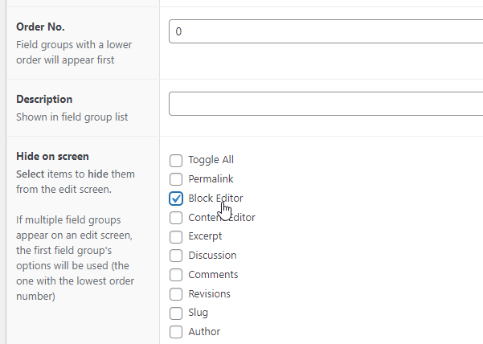

# Neobabis Block Editor Hide ως ACF option

Δες αναλυτικά το σχετικό άρθρο μου:

[Απόκρυψη Gutenberg editor ΜΟΝΟ για συγκεκριμένες σελίδες - προσθήκη hide option με χρήση ACF](https://neobabis.gr/hide-gutenberg-specific-pages-with-acf)

